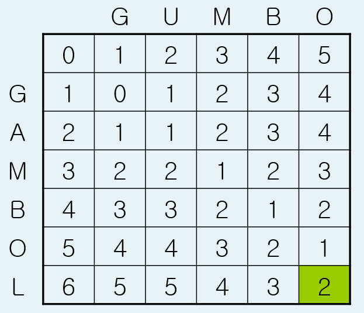

# Q36 : 편집거리 by KKS
> 문제 주소: book
> 
> category: DP

## 1.문제설명
- 두개의 문자열 A,B가 주어지고 A를 편집하여 B로 만들려고한다.
- 편집할때는 삽입, 삭제, 교체 작업만 할수있다.
- A를 B로 편집하기 위한 최소 편집횟수는?
## 2. 문제 접근법 
- 2차원 DP테이블을 이용하여 편집하면된다.
## 3.문제 해결 아이디어 or 핵심

- 이 사진을 참고하자.
- row와 col의 문자가 일치하면 왼쪽 위 대각선의 수를 그대로 쓰면되고
- 일치하지 않으면 점화식은 다음과같다.
```python
dp[i][j] = min(dp[i][j - 1], dp[i - 1][j - 1], dp[i - 1][j]) + 1
```
## 4.특별히 참고할 사항
- 이 문제도 대표적인 DP문제인거같다.
- 한번 풀고나면 쉽게 풀수있어서 코테에는 안나올꺼같지만 면접에서는 물어볼수도 있을꺼같다.

## 5.코드구현
``` python
str1 = input()
str2 = input()

n = len(str1)
m = len(str2)
dp = [[0] * (1 + m) for _ in range(1 + n)]
for i in range(1, n + 1):
    dp[i][0] = i
for j in range(1, m + 1):
    dp[0][j] = j
for i in range(1, n + 1):
    for j in range(1, m + 1):
        if str1[i - 1] == str2[j - 1]:
            dp[i][j] = dp[i - 1][j - 1]
        else:
            dp[i][j] = min(dp[i][j - 1], dp[i - 1][j - 1], dp[i - 1][j]) + 1

print(dp[n][m])


```